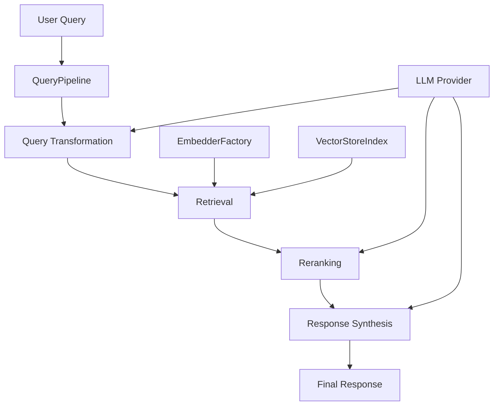

# Architecture Document: Advanced RAG Pipeline

## 1. Overview

This document outlines the architecture of the **Advanced RAG Pipeline**, a system designed for ingesting, processing, enriching, and indexing heterogeneous documents (primarily technical documents like PDFs and source code) to support Retrieval-Augmented Generation (RAG) applications.

The core goal is to create high-quality, context-aware text nodes suitable for semantic search via vector embeddings and for providing relevant context to Large Language Models (LLMs) during query time. Key features include robust document type detection, specialized chunking strategies for different content types (Docling for documents, AST-based for code), optional LLM-based metadata enrichment, persistent document processing status tracking via a registry, and flexible configuration.

The system also provides a comprehensive query module with modular components for query transformation, retrieval, reranking, and synthesis, ensuring embedding consistency between indexing and querying for optimal retrieval performance.

## 2. Key Features

*   **Unified Ingestion:** Handles diverse sources like code repositories and document folders.
*   **Enhanced Document Detection:** Uses multiple strategies (extension, magic numbers, content analysis via `EnhancedDetectorService`) for accurate routing.
*   **Specialized Chunking:**
    *   **Documents (PDF, etc.):** Leverages `DoclingReader` and `DoclingNodeParser` for structure-aware chunking.
    *   **Code:** Employs `EnhancedCodeSplitter` with multi-strategy fallback (prioritizing Chonkie AST, LlamaIndex AST, semantic, basic lines).
*   **Advanced Query Processing:**
    *   **Query Transformation:** Supports query rewriting, expansion, and decomposition.
    *   **Multiple Retrieval Strategies:** Vector, hybrid, and ensemble retrieval options.
    *   **Reranking:** Semantic, LLM-based, and provider-specific reranking.
    *   **Response Synthesis:** Multiple synthesis strategies from simple to tree-based.
*   **Metadata Formatting:** Standardizes and formats raw metadata (e.g., from Docling) into clean, readable keys using `DoclingMetadataFormatter`.
*   **Conditional LLM Enrichment:** Generates titles, summaries, and potentially Q&A pairs for nodes using configured LLMs (`DoclingMetadataGenerator`, `CodeMetadataGenerator`), controlled by flags (`enrich_documents`, `enrich_code`). Enrichment prompts are designed to utilize available context.
*   **Modular Embedding:** Generates vector embeddings for nodes using configurable embedding providers (HuggingFace, OpenAI, Ollama, etc.) via `LlamaIndexEmbedderService`, with batch processing and caching for performance.
*   **Document Registry:** Uses SQLite (`DocumentRegistry`) to track file hashes, processing status (Pending, Processing, Completed, Failed), and modification times, preventing redundant processing and enabling efficient pipeline runs.
*   **Configurable Pipeline:** Utilizes Python dataclasses (`core/config.py`) for detailed configuration of all stages.
*   **Modular Components:** Follows interface-based design (`core/interfaces.py`) for loaders, detectors, processors, enrichers, embedders, etc.
*   **LLM Abstraction:** Supports different LLM providers via `llm/providers.py`.
*   **Node Output Control:** Uses LlamaIndex's `excluded_llm_metadata_keys` and `excluded_embed_metadata_keys`, managed by the `DoclingMetadataFormatter`, to control the final text representation for different use cases. It also adds a consolidated `formatted_metadata` field via the formatter's `_apply_template` method.

## 3. Architecture Diagram

### High-Level Pipeline

```mermaid
graph TD
    subgraph Input
        A[Source Directory/File]
    end

    subgraph Orchestration [PipelineOrchestrator]
        B[Load Documents] --> C{Check Registry};
        C -- Need Processing --> D[Load Content];
        C -- Skip --> Z([End/Skip]);
        D --> E[Ingestion Pipeline];
        E --> F[1. DocumentTypeRouter];
        F -- Route --> G{Processor};
        G -- Doc --> H[TechnicalDocumentProcessor];
        G -- Code --> I[CodeProcessor];
        H --> H1[DoclingChunker];
        H1 --> H2(Raw Doc Nodes);
        H --> H3{Enrich?};
        H3 -- Yes --> H4[DoclingMetadataGenerator];
        H3 -- No --> H5[Nodes w/ Raw Meta];
        H4 --> H5;
        I --> I1[EnhancedCodeSplitter];
        I1 --> I2(Raw Code Nodes);
        I --> I3{Enrich?};
        I3 -- Yes --> I4[CodeMetadataGenerator];
        I3 -- No --> I5[Nodes w/ Structural Meta];
        I4 --> I5;
        H5 --> J(Processed Nodes);
        I5 --> J;
        F -- Return Nodes --> K[2. DoclingMetadataFormatter];
        K -- Format Metadata --> L[Add formatted_ Keys];
        L --> M[Set Exclusion Keys];
        M -- Final Nodes --> O1[EmbedderService];
        O1 -- Batch Embed --> O2[VectorStoreAdapter];
        O2 -- Store --> P[Vector Store Index];
        O2 -- Save --> Q[Saved node_contents.txt];
    end
        L -- Apply Template --> M[Add formatted_metadata Key];
        M -- Set Exclusions --> N[Final Nodes];
        E -- Return Final Nodes --> O1[Embedding];
        O1 --> O2[Store Nodes];
    end

    subgraph Output
        P[Vector Store Index]
        Q[Saved node_contents.txt]
    end
    
    subgraph Shared_Services
        R[DocumentRegistry]
        S[EnhancedDetectorService]
        T[LLMProvider]
        U[EmbedderService]
        V[VectorStoreFactory]
    end

    O2 --> P;
    O2 --> Q;
    C --> R;
    B --> R; # Loader might interact later for checks
    F --> S; # Router uses Detector
    H4 --> T; # Enrichers use LLM
    I4 --> T; # Enrichers use LLM
    O1 --> U; # Embedding uses EmbedderService
    O2 --> V; # VectorStore uses VectorStoreFactory

    style Z fill:#f9f,stroke:#333,stroke-width:2px
```

**Diagram Notes:**

*   The diagram illustrates the main flow managed by the `PipelineOrchestrator`.
*   The `DocumentTypeRouter` acts as the central dispatch point within the `IngestionPipeline`.
*   Enrichment happens *within* the respective processor steps *if enabled* by the configuration.
*   The `DoclingMetadataFormatter` runs *after* the router and processors, adding formatted keys and the consolidated `formatted_metadata` string, and setting the final exclusion lists.

## 4. Component Breakdown

1.  **`main.py`**:
    *   **Role:** Entry point, configuration loading, initialization of core components (Registry, Orchestrator), pipeline execution trigger, output saving.
    *   **Key Files:** `main.py`

2.  **`core/`**:
    *   **Role:** Defines fundamental interfaces, configuration dataclasses, and core data models.
    *   **Key Files:** `config.py`, `interfaces.py`, `models.py`

3.  **`registry/`**:
    *   **Role:** Manages persistent state about documents, preventing reprocessing.
    *   **Key Files:** `document_registry.py`, `status.py`, `exceptions.py`

4.  **`detectors/`**:
    *   **Role:** Identifies document types using various strategies.
    *   **Key Files:** `enhanced_detector_service.py`, `document_detector.py`, `detector_factory.py`

5.  **`embedders/`**:
    *   **Role:** Generates vector embeddings for nodes using various providers.
    *   **Key Files:** `llamaindex_embedder_service.py`, `embedder_factory.py`

6.  **`loaders/`**:
    *   **Role:** Reads documents from sources into LlamaIndex `Document` objects. Routes based on detected type.
    *   **Key Files:** `enhanced_directory_loader.py`, `directory_loader.py`, `code_loader.py`

7.  **`processors/`**:
    *   **Role:** Handles chunking, metadata formatting, and metadata enrichment for specific document types.
    *   **Key Files:**
        *   `document_router.py`: Routes documents to processors based on type.
        *   `document/`: Contains logic for PDF, DOCX, etc.
            *   `document_processor.py`: Orchestrates document chunking, formatting, and enrichment.
            *   `docling_chunker.py`: Uses Docling via LlamaIndex components for chunking.
            *   `docling_metadata_formatter.py`: Formats raw Docling metadata and sets exclusion keys.
            *   `metadata_generator.py` (`DoclingMetadataGenerator`): LLM enrichment for documents.
        *   `code/`: Contains logic for source code files.
            *   `code_processor.py`: Orchestrates code splitting and enrichment.
            *   `code_splitter.py` (`EnhancedCodeSplitter`, `CodeSplitterAdapter`): Performs code chunking (Chonkie, LlamaIndex AST, etc.).
            *   `metadata_generator.py` (`CodeMetadataGenerator`): LLM enrichment for code.
            *   `language_detector.py`: Detects code language.

8.  **`llm/`**:
    *   **Role:** Handles interaction with LLMs, including provider abstraction, prompt management, and optional caching.
    *   **Key Files:** `providers.py`, `prompts.py`, `cache.py`

9.  **`indexing/`**:
    *   **Role:** Handles embedding generation and vector store interaction (e.g., ChromaDB, Qdrant, SimpleVectorStore).
    *   **Key Files:** `vector_store.py` (Vector store adapters and factory)

10. **`query/`**:
    *   **Role:** Handles query processing, retrieval, reranking, and response synthesis.
    *   **Key Files:**
        *   `query_pipeline.py`: Main pipeline orchestration.
        *   `retrieval/retriever.py`: Vector, hybrid, and ensemble retrievers.
        *   `transformers/`: Query transformation strategies.
        *   `reranking/`: Reranking implementations.
        *   `synthesis/`: Response synthesis strategies.

9.  **`pipeline/`**:
    *   **Role:** Orchestrates the entire ingestion process.
    *   **Key Files:** `orchestrator.py`

## 5. Data Flow & Pipeline Steps

1.  **Initialization (`main.py`):**
    *   Load `UnifiedConfig`.
    *   Initialize `DocumentRegistry`.
    *   Initialize `LLMProvider`.
    *   Initialize `PipelineOrchestrator`, which sets up:
        *   `EnhancedDirectoryLoader` (knows about DoclingReader, CodeLoader)
        *   `EnhancedDetectorService`
        *   `CodeProcessor` (with optional `CodeMetadataGenerator`)
        *   `TechnicalDocumentProcessor` (with `DoclingChunker` and optional `DoclingMetadataGenerator`)
        *   `DoclingNodeParser`
        *   `DoclingMetadataFormatter`
        *   `DocumentTypeRouter` (gets processors and *references* to their enrichers)
        *   `IngestionPipeline` containing `[document_router, docling_formatter]`.

2.  **File Discovery & Filtering (`PipelineOrchestrator.run`):**
    *   `_list_all_files` scans the input directory.
    *   If the registry is enabled, `should_process` checks each file's status and hash against the registry. Files already processed and unchanged are skipped.

3.  **Document Loading (`PipelineOrchestrator.run` -> `EnhancedDirectoryLoader`):**
    *   Loads only the necessary documents (new, changed, or all if registry is off).
    *   The `EnhancedDirectoryLoader` uses the `EnhancedDetectorService` to determine type and delegates loading to specialized internal loaders (`DoclingReader`, `CodeLoader`, `DirectoryLoader` as fallback). Initial metadata (`file_path`, etc.) is added.

4.  **Ingestion Pipeline Execution (`PipelineOrchestrator.run` -> `pipeline.run`):**
    *   **Step 1: `DocumentTypeRouter.__call__`:**
        *   Iterates through input `Document` objects.
        *   Determines `doc_type` (using metadata, potentially re-checking with detector service if needed).
        *   Calls the appropriate processor's `process_document` method:
            *   **If `TechnicalDocumentProcessor.process_document`:**
                *   Calls `DoclingChunker.chunk_document` -> returns `TextNode`s with raw Docling metadata.
                *   *If* `self.enricher` (`DoclingMetadataGenerator`) exists: calls `self.enricher.enrich(nodes)` -> adds LLM-generated keys (`functional_title`, `concise_summary`, `generated_questions_list`) to node metadata. The prompts used by the enricher now expect *formatted* keys (which aren't added yet - see step 5!).
                *   Calls `self.formatter._apply_template(node)` -> adds `formatted_metadata` key.
                *   Sets `excluded_llm/embed_metadata_keys`. **<- Needs update: This should happen *after* the formatter runs in the main pipeline.**
            *   **If `CodeProcessor.process_document`:**
                *   Calls `CodeSplitterAdapter.split` -> returns `TextNode`s with structural code metadata.
                *   *If* `self.metadata_generator` (`CodeMetadataGenerator`) exists: calls `self.metadata_generator.enrich(nodes)` using *enhanced prompts* -> adds `title`, `description`.
                *   Calls `self._apply_template(node)` -> adds `formatted_metadata` key.
                *   Sets `excluded_llm/embed_metadata_keys`. **<- Needs update: This should happen *after* the formatter runs in the main pipeline.**
        *   Returns the collected list of processed (and potentially enriched) nodes.
    *   **Step 2: `DoclingMetadataFormatter.__call__`:**
        *   Receives the list of nodes from the router.
        *   Identifies Docling nodes.
        *   *Adds* the `formatted_source`, `formatted_location`, `formatted_headings`, `formatted_label` keys to the metadata of Docling nodes.
        *   Calls `self._apply_template(node)` to add the `formatted_metadata` key.
        *   **Sets the final `excluded_llm_metadata_keys` and `excluded_embed_metadata_keys`** based on its configuration (`config.include_in_llm`, `config.include_in_embed`), ensuring raw keys are out and desired formatted/enriched keys are in.

5.  **Embedding (EmbedderService):**
    *   The formatted nodes are passed to the modular embedder service for vector embedding generation.
    *   The embedder service is instantiated via a factory, supporting multiple providers (HuggingFace, OpenAI, Cohere, Vertex, Bedrock, Ollama, etc.).
    *   Batch embedding and disk-based caching are used for performance and efficiency.
    *   Provider fallback logic ensures robust operation if the primary provider fails.
    *   Embedding performance metrics (nodes/second) and errors are logged.

6.  **Vector Storage (VectorStoreAdapter):**
    *   Embedded nodes are passed to the vector store adapter, created via a factory based on configuration.
    *   Supports ChromaDB, Qdrant (local/cloud), and SimpleVectorStore (in-memory, dependency-free fallback).
    *   Multi-level fallback chain: tries user-selected engine, then alternatives, finally in-memory fallback.
    *   Consistent node preparation, metadata filtering, and relationship sanitization across all stores.
    *   Detailed timing/logging for all operations.

7.  **Return & Save:**
    *   The final list of nodes is returned and saved by `main.py`.
    *   Output views (`ALL`, `LLM`, `EMBED`) are controlled by exclusion keys set in the final formatting step.

## 6. Metadata Handling Summary

*   **Loading:** Basic file metadata (`file_path`, `file_name`, initial `file_type`).
*   **Chunking:** Adds chunk-specific metadata (e.g., `start/end_line`, `chunking_strategy` for code; raw `prov`, `doc_items`, `headings` for Docling).
*   **Enrichment (Optional):** Adds semantic metadata (`title`, `description`, `summary`, etc.) via LLM calls within the processors. Uses enhanced prompts with available context.
*   **Formatting (Docling Nodes):** The `DoclingMetadataFormatter` runs *after* processing/enrichment. It adds *new* `formatted_...` keys based on raw Docling metadata.
*   **Consolidated Formatting:** The `_apply_template` method (currently *within* the Formatter, as per user confirmation) creates a single `formatted_metadata` key containing a combined view of formatted structural and enriched metadata.
*   **Exclusion Control:** The `DoclingMetadataFormatter` is the *final step* that sets `excluded_llm_metadata_keys` and `excluded_embed_metadata_keys`. It uses its `config.include_in_...` lists to determine which keys (including `formatted_metadata`, `formatted_source`, etc., and potentially enriched keys like `title` if added to the config) should be visible in the final output for LLM and Embedding modes. Raw keys (`origin`, `prov`, `doc_items`) are explicitly excluded.

## 7. Configuration System

### Configuration Architecture

The system uses a comprehensive configuration architecture with multiple layers:

1. **Pydantic Models (`core/config.py`)**: Provides robust validation, documentation, and type safety for all configuration settings.
2. **Configuration Manager (`core/config_manager.py`)**: Centralizes loading from multiple sources with clear precedence.
3. **Environment Variables**: Supports sensitive credentials and deployment-specific settings.
4. **YAML Configuration Files**: Enables environment-specific configuration (development, testing, staging, production).
5. **Command-line Arguments**: Allows runtime overrides for key settings.

### Configuration Loading Precedence

The configuration system follows a clear precedence order (lowest to highest):

1. Default values from Pydantic models
2. Environment-specific configuration files (e.g., `config.development.yaml`)
3. Main configuration file (`config.yaml`)
4. Environment variables (prefixed with `RAG_`)
5. Explicit overrides (e.g., command-line arguments)

### Key Configuration Components

* **UnifiedConfig**: Main configuration model that includes all component configurations
* **ConfigManager**: Handles loading, validation, merging, and caching of configuration
* **ApplicationEnvironment**: Enum for different deployment environments
* **Component-specific configs**: Specialized configuration for each system component:
  * LLM settings (`LLMConfig`, `LLMSettings`) with separate configurations for metadata, query, and coding LLMs
  * Document detection settings (`DetectorConfig`)
  * Chunking parameters (`CodeProcessorConfig`, `DoclingConfig`)
  * Embedding models and providers (`EmbedderConfig`)
  * Vector store settings (`VectorStoreConfig`) with secure API key handling
  * Document registry settings (`RegistryConfig`)
  * Query pipeline configuration (`QueryPipelineConfig`) with nested configurations for transformation, retrieval, reranking, and synthesis

### Secure Credential Management

The system implements secure patterns for handling sensitive credentials:

* API keys are loaded from environment variables, not hardcoded
* Environment variable names are configurable (e.g., `api_key_env_var: "OPENAI_API_KEY"`)
* The `.env` file is used for local development but excluded from version control
* Production deployments use system environment variables

### Configuration Validation

Pydantic models provide comprehensive validation:

* Type checking for all configuration values
* Range validation for numeric parameters (e.g., `ge=0.0, le=1.0` for confidence thresholds)
* Enum validation for categorical parameters
* Cross-field validation using model validators
* Automatic directory creation for output paths

### Application Initialization

The application initialization flow (`app_config.py` and `main.py`) uses the configuration system:

1. Parse command-line arguments
2. Initialize ConfigManager with appropriate paths
3. Load unified configuration with overrides
4. Initialize components based on configuration
5. Run the pipeline with initialized components

## 8. Extensibility

- **New Embedding Providers**: Add a new provider class to `embedders/`, update the factory, and add config options.
- **New Vector Stores**: Add a new adapter to `indexing/`, update the factory, and add config options.
- **Query Components**: Add new transformers, retrievers, rerankers, or synthesizers to the query module.
- **Fallbacks**: All new providers should implement error/fallback logic for robust operation.
- **Testing**: In-memory vector store and mock embedders make testing easy without external dependencies.

Other extension points (detectors, chunkers, enrichers) follow the same modular, interface-driven pattern.

## 9. Query Module Architecture

### Overview

The query module provides a comprehensive solution for processing queries against the indexed documents. It implements a modular, configurable approach to query transformation, retrieval, reranking, and synthesis.

### Components

1. **Query Pipeline**
   - `QueryPipeline` class orchestrates the entire query process
   - Configurable components for each stage of the pipeline
   - Support for caching and performance metrics
   - Embedding consistency between indexing and querying

2. **Query Transformation**
   - `QueryTransformer` base class with multiple implementations:
     - `HyDEQueryExpander`: Hypothetical document expansion
     - `LLMQueryRewriter`: LLM-based query rewriting
     - `QueryDecomposer`: Complex query decomposition

3. **Retrieval**
   - `EnhancedRetriever`: Base retriever with vector search
   - `HybridRetriever`: Combines vector and keyword search
   - `EnsembleRetriever`: Combines multiple retrievers with weighted scoring
   - Proper embedding model integration for consistent retrieval

4. **Reranking**
   - `Reranker` base class with multiple implementations:
     - `SemanticReranker`: Semantic similarity reranking
     - `LLMReranker`: LLM-based reranking
     - `CohereReranker`: Cohere-specific reranking

5. **Synthesis**
   - `ResponseSynthesizer` base class with multiple implementations:
     - `SimpleResponseSynthesizer`: Direct synthesis
     - `RefineResponseSynthesizer`: Iterative refinement
     - `TreeSynthesizer`: Tree-based synthesis
     - `CompactResponseSynthesizer`: Concise response generation

### Query Flow



### Embedding Consistency

A critical aspect of the query module is ensuring embedding consistency between indexing and querying:

1. **Problem**: LlamaIndex's `VectorIndexRetriever` defaults to OpenAI embeddings during query time if not explicitly configured.

2. **Solution**: 
   - The `EnhancedRetriever` accepts an `embed_model` parameter and passes it to the `VectorIndexRetriever`
   - The `QueryPipeline` initializes and uses the embedder from `EmbedderFactory`
   - The embedder is explicitly passed to all retriever implementations
   - Examples demonstrate proper embedder configuration and usage

3. **Benefits**:
   - Consistent embedding space between indexing and querying
   - Improved retrieval quality and relevance
   - Support for various embedding models (OpenAI, HuggingFace, Ollama, etc.)
   - Clear dependency injection pattern
